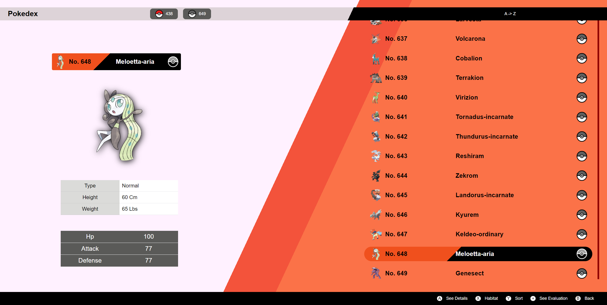

# React Pokedex

This is my very first project using VS Code and I'm really proud of it! 🤩  

I wanted to learn how to use it as I always work with gitpod's workspaces.  

When you run this application for the first time, you will see the latest pokedex design (although I did not include all the 902 existing pokemons, this will be a great to Do thing in addition to other pokedex functionalities).

In order to get all the information I needed, I used Pokemon's API (you can visit it through the following link: "https://pokeapi.co/").

Using FETCH function, I was able to get all 649 pokemons and show their names, images, stats...

I really hope you like it and please, feel free to make any suggestions in order to make this app better! 👏  

## Available Scripts

In the project directory, you can run:

### `npm start`

Runs the app in the development mode.\
Open [http://localhost:3000](http://localhost:3000) to view it in your browser.

